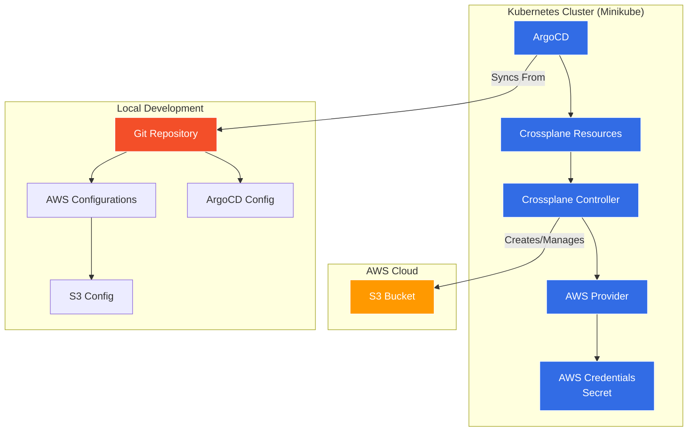

# Crossplane AWS Resource Examples

This repository contains example configurations for managing AWS resources using Crossplane with GitOps using ArgoCD.

## Architecture

Below is the high-level architecture diagram of how the components interact:



The architecture consists of three main components:
1. **Local Development**: Contains the Git repository with AWS resource configurations and ArgoCD settings
2. **Kubernetes Cluster**: Runs ArgoCD and Crossplane to manage AWS resources
3. **AWS Cloud**: Where the actual resources (S3) are created and managed

## Prerequisites

1. A Kubernetes cluster (Minikube) with Crossplane installed
2. AWS Provider for Crossplane installed
3. AWS credentials configured as a Kubernetes secret
4. ArgoCD installed in your cluster

## Installing Crossplane

1. Add the Crossplane Helm repository:
```bash
helm repo add crossplane-stable https://charts.crossplane.io/stable
helm repo update
```

2. Create namespace for Crossplane:
```bash
kubectl create namespace crossplane-system
```

3. Install Crossplane using Helm:
```bash
helm install crossplane \
  crossplane-stable/crossplane \
  --namespace crossplane-system \
  --version 1.14.1
```

4. Verify the installation:
```bash
kubectl get pods -n crossplane-system
```

5. Install AWS Provider:
```bash
kubectl apply -f config/crossplane/provider.yaml
```

6. Wait for the provider to be healthy:
```bash
kubectl get provider.pkg
```

## Setup AWS Credentials

First, create a secret with your AWS credentials:

```bash
# DO NOT commit actual credentials to version control
kubectl create secret generic aws-creds -n crossplane-system --from-literal=credentials='[default]
aws_access_key_id=REPLACE_WITH_YOUR_ACCESS_KEY_ID
aws_secret_access_key=REPLACE_WITH_YOUR_SECRET_ACCESS_KEY'
```

Alternatively, you can use the provided script:
```bash
# 1. Edit aws-credentials.sh with your actual credentials
# 2. Make the script executable
chmod +x config/crossplane/aws-credentials.sh
# 3. Run the script
./config/crossplane/aws-credentials.sh
```

## Installing ArgoCD on Minikube

1. Create the ArgoCD namespace:
```bash
kubectl create namespace argocd
```

2. Install ArgoCD:
```bash
kubectl apply -n argocd -f https://raw.githubusercontent.com/argoproj/argo-cd/stable/manifests/install.yaml
```

3. Access ArgoCD UI using port-forwarding:
```bash
kubectl port-forward svc/argocd-server -n argocd 8080:443
```
Then visit: https://localhost:8080

## Available Resources

### S3 Bucket
The `infrastructure/aws/s3/s3bucket.yaml` creates an S3 bucket with:
- Private ACL
- Versioning enabled
- Server-side encryption with AES256

## GitOps Setup

1. Fork this repository and clone it
2. Update the ArgoCD application manifest in `applications/argocd/application.yaml`:
   - Repository URL is set to: https://github.com/example/crossplane-demo.git
3. Apply the ArgoCD application:
```bash
kubectl apply -f applications/argocd/application.yaml
```

## Monitoring Resources

Check the status of your resources:
```bash
kubectl get bucket
```

View detailed status:
```bash
kubectl describe bucket my-crossplane-bucket
```

Check ArgoCD application status:
```bash
kubectl get applications -n argocd
kubectl describe application crossplane-resources -n argocd
```

## Cleanup

To delete the resources:
1. Delete the ArgoCD application:
```bash
kubectl delete -f applications/argocd/application.yaml
```

2. Delete resources directly:
```bash
kubectl delete -f infrastructure/aws/s3/s3bucket.yaml
``` 